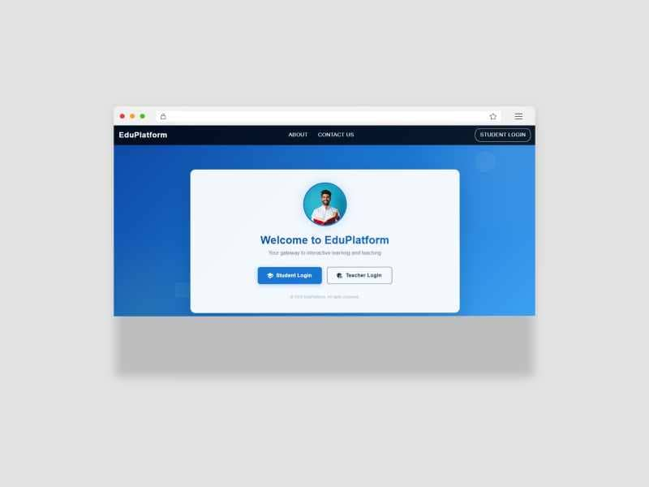
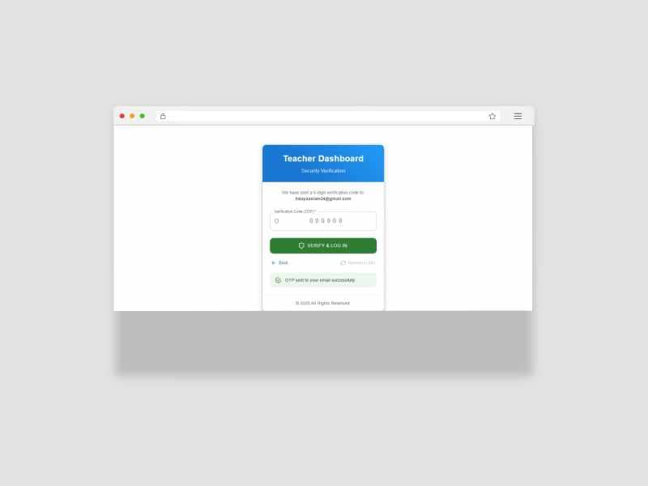
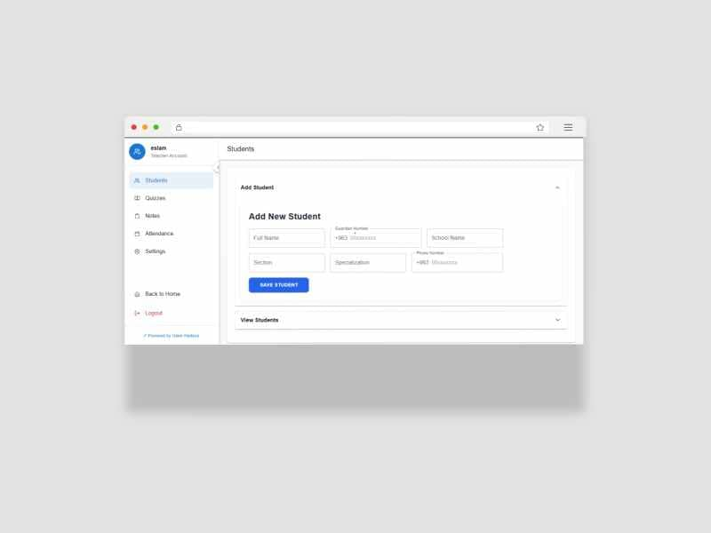
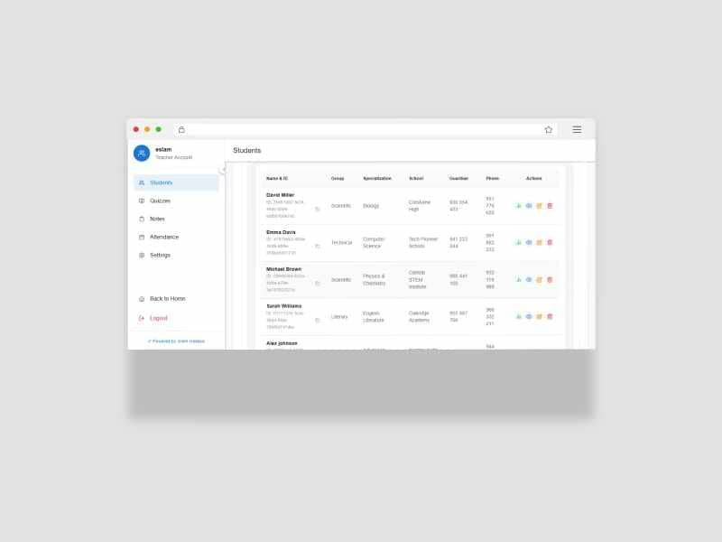
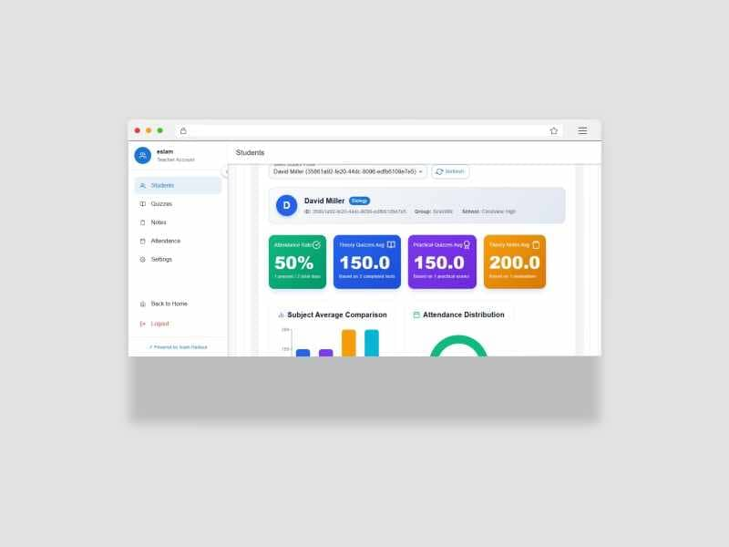
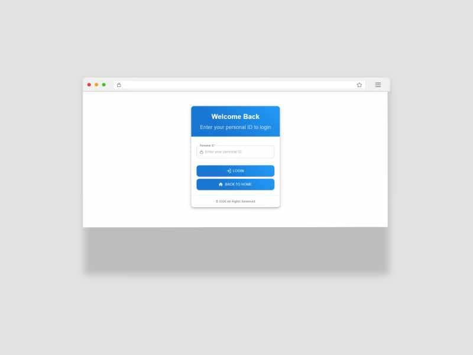
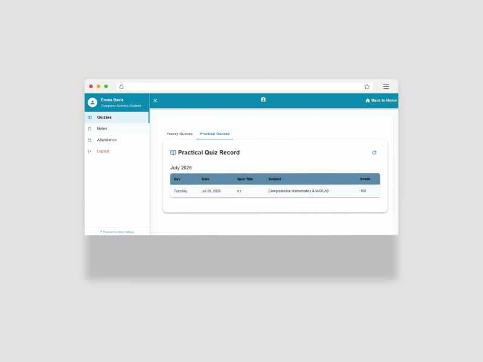

# Student Administration — Web Frontend

[](https://nextjs.org)
[](https://mui.com)
[](https://recharts.org)

Teacher dashboard and student portal for the Student Administration System — built with Next.js 14 and Material-UI. Provides an intuitive interface for managing student records, grades, quizzes, attendance, and interactive data analytics.

> 🔗 Backend repository: [e-school-server](https://github.com/eslam-cmd/e-school-server)

---

## ✨ Features

### Teacher Dashboard

- **Student Management** — Create, edit, view, and delete student records
- **Interactive Analytics & Charts** — Comprehensive visual breakdown (Bar, Pie, Area charts) for individual student performance, attendance distribution, and academic progress
- **Grade Entry** — Input practical and theoretical grades per subject
- **Quiz Creation** — Build and assign practical and theoretical quizzes
- **Attendance Marking** — Daily attendance tracking (present/absent)
- **ID Generation** — System auto-generates unique student IDs upon creation
- **Account Handoff** — Copy generated IDs to distribute to students

### Student Portal

- **Secure Login** — Authenticate using the teacher-provided ID
- **2FA Verification** — Enter email verification code to access account
- **Digital ID Card** — View personal academic ID with enrollment details
- **Grade & Performance Visuals** — See practical and theoretical grades visualized via real-time charts
- **Quiz Results** — Review completed quiz scores
- **Attendance Calendar** — Track present and absent days
- **Profile Settings** — Update account information and password

### UI/UX

- **Material-UI Design** — Clean, modern interface with responsive layout
- **Role-Based Views** — Different dashboards for Teachers and Students
- **Data Tables & Charts** — Sortable, filterable tables alongside responsive `Recharts` data visualization
- **Form Validation** — Real-time input validation with error messages
- **Loading States** — Smooth loading indicators and skeleton screens

---

## 🛠 Tech Stack

| Layer            | Technology               |
| ---------------- | ------------------------ |
| Framework        | Next.js 14 (App Router)  |
| Language         | JavaScript               |
| UI Library       | Material-UI (MUI)        |
| Visualization    | Recharts                 |
| HTTP Client      | Axios                    |
| Styling          | MUI System + CSS Modules |
| State Management | React Context + Hooks    |

---

## 🔄 How It Works

### Teacher Workflow

```
Login as Teacher
│── Dashboard loads
│── Navigate to "Students"
│── Click "Add Student"
│── Fill form → Submit
│◄── System generates unique Student ID
│── Analyze performance via "Student Stats" (Interactive Charts)
│── Copy ID and share with student (offline/manual)
```

### Student Workflow

```
Receive Student ID from teacher
│── Navigate to Login
│── Enter Student ID + Password
│── Check email for 2FA code
│── Enter verification code
│◄── Access granted to Student Portal
```

---

## 🚀 Getting Started

### Prerequisites

- Node.js >= 18
- Backend API running (see backend repo)

### Installation

```bash
# Clone repository
git clone https://github.com/eslam-cmd/e-school-client.git
cd e-school-client

# Install dependencies
npm install

# Setup environment
cp .env.example .env.local
```

### Environment Variables

```env
NEXT_PUBLIC_API_URL=http://localhost:5001
```

### Run

```bash
# Development
npm run dev

# Production build
npm run build
npm start
```

App runs at `http://localhost:3000`

---

## 📸 Project Screenshots

|                        01. Home Page                         |                 02. Teacher Login & 2FA Verification                 |
| :----------------------------------------------------------: | :------------------------------------------------------------------: |
|  |  |

|                        03. Add New Student                         |                        04. All Students View                         |
| :----------------------------------------------------------------: | :------------------------------------------------------------------: |
|  |  |

|               05. Selected Student Analytics & Charts                |                        06. Student Login via ID                         |
| :------------------------------------------------------------------: | :---------------------------------------------------------------------: |
|  |  |

|                   07. Student Portal Details & Overview                    |
| :------------------------------------------------------------------------: |
|  |

---

## 📁 Project Structure

```
client/
├── .gitignore
├── eslint.config.mjs
├── jsconfig.json
├── next.config.mjs
├── package-lock.json
├── package.json
├── README.md
├── public/
│   ├── google95cc1245a4caed06.html
│   ├── img/
│   ├── logo2.jpg
│   └── logo5.jpeg
├── src/
│   ├── app/
│   │   ├── layout.js
│   │   ├── page.js
│   │   ├── theme.js
│   │   └── (site)/
│   │       └── (page)/
│   │           ├── home-page/
│   │           ├── student/
│   │           │   ├── login/
│   │           │   │   └── page.jsx
│   │           │   └── my-account/
│   │           │       └── page.jsx
│   │           └── teacher/
│   │               ├── dashboard-admin/
│   │               │   └── page.jsx
│   │               └── login/
│   │                   └── page.js
│   ├── components/
│   │   ├── auth/
│   │   │   ├── login-student/
│   │   │   │   └── Login.jsx
│   │   │   └── login-tetcher/
│   │   │       └── login.jsx
│   │   ├── home/
│   │   │   ├── aboutislam/
│   │   │   │   └── aboutIslam.jsx
│   │   │   ├── aboutus/
│   │   │   │   └── aboutUs.jsx
│   │   │   ├── homepage/
│   │   │   │   └── HomePage.jsx
│   │   │   └── homescreen.jsx
│   │   ├── student/
│   │   │   ├── dashboard.jsx
│   │   │   └── sections/
│   │   │       ├── attendance/
│   │   │       │   └── viewAttendance.jsx
│   │   │       ├── exams/
│   │   │       │   └── viewExams.jsx
│   │   │       ├── practicalNotes/
│   │   │       │   └── ViewPracticalNotes.jsx
│   │   │       ├── practicalQuiz/
│   │   │       │   └── ViewPracticalQuiz.jsx
│   │   │       └── quizzes/
│   │   │           └── viewQuizzes.jsx
│   │   ├── teacher/
│   │   │   ├── dashboard.jsx
│   │   │   └── sections/
│   │   │       ├── Students/
│   │   │       │   ├── addStudents.jsx
│   │   │       │   ├── StudentStats.jsx
│   │   │       │   └── viewStudents.jsx
│   │   │       ├── attendance/
│   │   │       │   ├── addAttendance.jsx
│   │   │       │   └── viewAttendance.jsx
│   │   │       ├── examstheory/
│   │   │       │   ├── addExams.jsx
│   │   │       │   └── viewExams.jsx
│   │   │       ├── practicalNotes/
│   │   │       │   ├── addPracticalNotes.jsx
│   │   │       │   └── viewPracticalNotes.jsx
│   │   │       ├── practicalQuiz/
│   │   │       │   ├── addPracticalQuiz.jsx
│   │   │       │   └── viewPracticalQuiz.jsx
│   │   │       ├── quizzestheory/
│   │   │       │   ├── addQuizzes.jsx
│   │   │       │   └── viewQuizzes.jsx
│   │   │       └── setting/
│   │   │           └── teacherProfile.jsx
│   │   └── Ultimit/
│   │       ├── footer.jsx
│   │       ├── header.jsx
│   │       └── loading.jsx
│   ├── styles/
│   │   └── globals.css
│   └── utils/
│       └── emotionCache.jsx
```

---

## 🎨 UI Components

### Teacher Views

| Component          | Purpose                                                 |
| ------------------ | ------------------------------------------------------- |
| StudentTable       | Sortable list with search, section filters, and actions |
| StudentStats       | Comprehensive analytics using Recharts (Bar/Pie/Area)   |
| StudentForm        | Dynamic form with subject assignment and validation     |
| GradeForm          | Subject + type (practical/theoretical) + score input    |
| AttendanceCalendar | Date picker + bulk attendance marking                   |

### Student Views

| Component          | Purpose                                             |
| ------------------ | --------------------------------------------------- |
| DigitalIDCard      | Styled card with student credentials and QR         |
| GradeChart         | Real-time performance distribution chart            |
| AttendanceTimeline | Interactive calendar with presence color indicators |

---

## 📬 Contact

Built by **Islam Hadaya**

- Portfolio: [my-profile-personal-nextjs.vercel.app](https://my-profile-personal-nextjs.vercel.app)
- LinkedIn: [Islam Hadaya](https://www.linkedin.com/in/Islam-hadaya)
- Email: [hdayaaslam34@gmail.com](mailto:hdayaaslam34@gmail.com)
